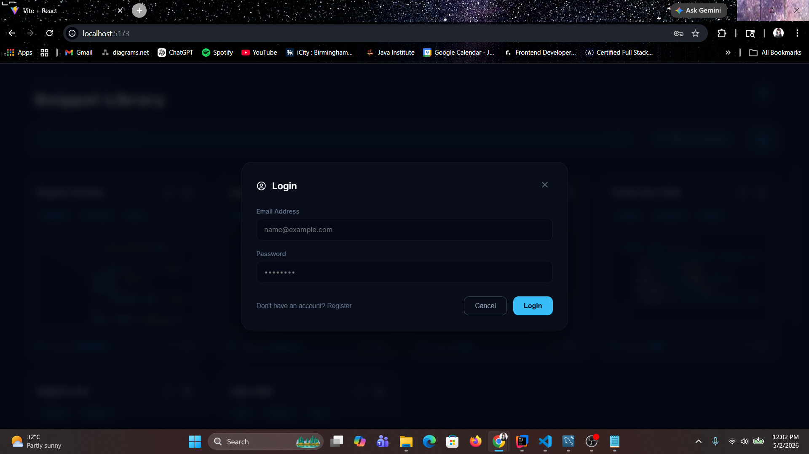
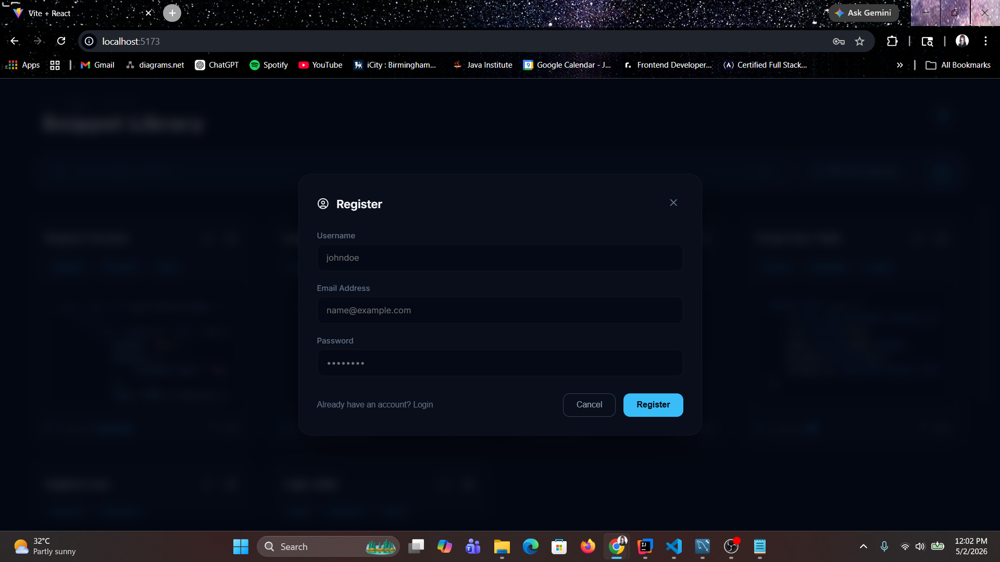
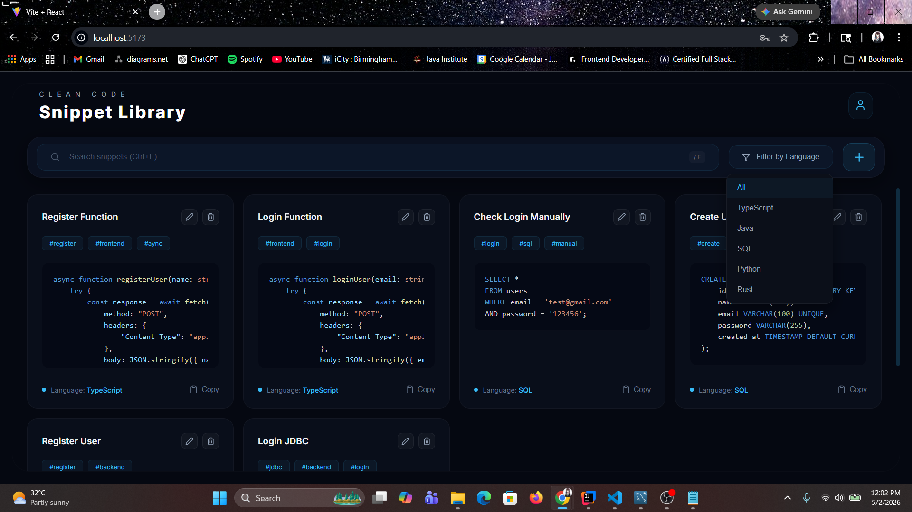
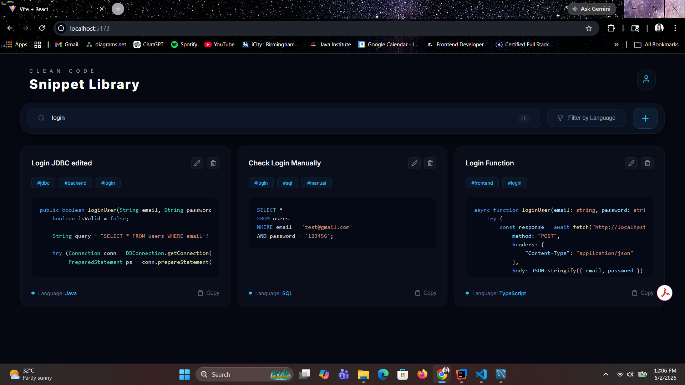
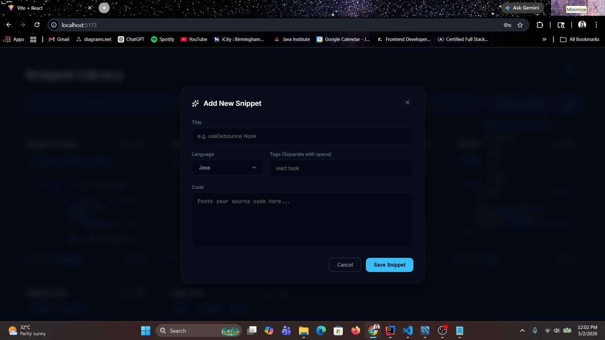
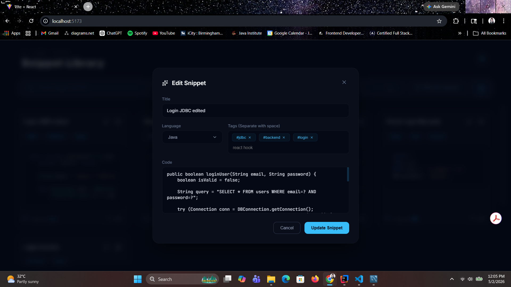

# CleanCode — Code Snippet Manager Web Application


**CleanCode** is a responsive, single-screen web application designed to store, categorize, and manage frequently used code snippets. Developed with **Spring Boot (Java), React, and MySQL**, CleanCode allows developers to securely register, organize snippets by language with custom tags, apply syntax highlighting, and quickly copy code to the clipboard.

---

## 📌 Features

- **User Authentication**

  • Registration and login  
  • Password hashing with BCrypt  
  • JWT-based session management  

- **Snippet Management**

  • Add, update, and delete snippets  
  • Syntax highlighting and color-coded UI  
  • Categorize snippets by language and tags  
  • Search snippets by title, tag, or content  
  • One-click copy to clipboard  

- **UI & Experience**

  • Responsive and streamlined single-screen layout  
  • Custom modern dark theme syntax  

---

## 📁 Project Structure

```text
cleancode/
│
├── backend/                             # Spring Boot backend
│   ├── src/main/java/com/cleancode/
│   │   ├── config/                      # Security and JWT configurations
│   │   ├── controller/                  # REST API endpoints
│   │   ├── dto/                         # Data transfer objects
│   │   ├── entity/                      # Database models
│   │   ├── repository/                  # JPA repositories
│   │   └── service/                     # Business logic
│   ├── src/main/resources/              # application.properties (DB config)
│   └── pom.xml                          # Maven dependencies
│
└── frontend/                            # React frontend
    ├── src/
    │   ├── api/                         # API communication (api.js with fetch)
    │   ├── assets/                      # Icons and static resources
    │   ├── styles/                      # CSS stylesheets
    │   ├── App.jsx                      # Main entry point
    │   └── App.css                      # Application styling
    ├── public/                          # Static files
    └── package.json                     # Node dependencies
```

---

## 🛠️ Technologies Used

| Layer           | Stack / Tools               |
| --------------- | --------------------------- |
| Frontend        | React, JavaScript, CSS      |
| Backend         | Spring Boot, Java, Maven    |
| Database        | MySQL                       |
| Icons           | `lucide-react`              |
| Syntax Highl.   | `react-syntax-highlighter`  |
| Auth & Security | JWT, BCrypt Password Hashing|

---

## 🗃️ Database

**Database name:** `clean_code_db`

Suggested tables:

| Table           | Purpose |
| --------------- | ------------------------------------- |
| `users`         | Stores user credentials & profile data |
| `snippets`      | Stores code snippet titles and content |
| `tags`          | Stores distinct tag names |
| `snippets_tags` | Join table associating tags to snippets |

> Create your database and connect it to the backend.

---

## 🚀 Getting Started

### Clone the Repository
```bash
git clone <your-repository-url>
cd cleancode/
```

### Backend Setup

1. Open `backend/src/main/resources/application.properties`.
2. Update the MySQL credentials to match your setup:

```properties
spring.datasource.url=jdbc:mysql://localhost:3306/clean_code_db
spring.datasource.username=root
spring.datasource.password=your_db_password
spring.jpa.hibernate.ddl-auto=update
```

3. Run the backend as a Spring Boot application via your IDE or terminal.

### Frontend Setup

1. Navigate to the frontend directory:

```bash
cd frontend/
```

2. Install the necessary dependencies (including Lucide icons and Syntax Highlighter):

```bash
npm install lucide-react react-syntax-highlighter
```

3. Run the development server:

```bash
npm run dev
```

4. Open your browser and navigate to the local development port (typically `http://localhost:5173`) to access the dashboard.

---

## 📸 Interface Preview

### Login


### Register


### Dashboard


### Search


### Add New Snippet


### Update Snippet


---

## 📃 License

This project is provided for educational and personal use. For commercial use, please contact the author.

---

## 👨‍💻 Author

Created by **Thedara Sasindi**  
*Full‑stack Software Engineer*  
GitHub: <https://github.com/sasindi22>  
Email: thedarasasindi@gmail.com
